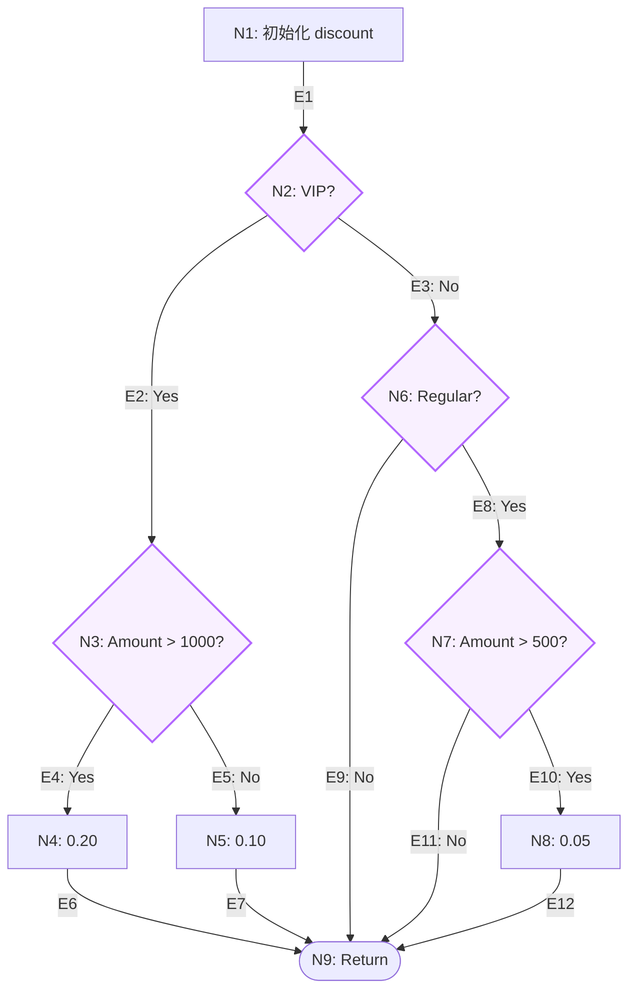

圈复杂度是一种衡量代码复杂度的指标，它可以帮助我们识别出代码中的复杂区域，从而更好地优化代码。圈复杂度越高，代码的复杂度越高，也就越难以阅读和维护。

<!--more-->

## 概念起源

这个概念由美国计算机科学家 **Thomas J. McCabe, Sr.** 在 1976 年的论文《A Complexity Measure》中首次提出，因此也被称为 **McCabe 复杂度**。

在 20 世纪 70 年代，随着软件系统规模急剧膨胀，测试 and 维护成本变得极高。当时的开发者缺乏一种客观、定量的手段来评估代码的“复杂度”。

McCabe 引入了**图论（Graph Theory）**的思想，将程序执行过程抽象为**控制流图（Control Flow Graph）**。其初衷是提供一个严谨的指标，用于：

- **识别高风险代码**：定位逻辑嵌套过深、易隐藏 Bug 的模块。
- **指导测试用例设计**：圈复杂度直接对应实现“分支覆盖”（Branch Coverage）所需的最小测试用例数。

McCabe 建议，单个模块或函数的圈复杂度**不应超过 10**，否则应考虑重构或拆分。

## 计算公式

基于图论，将代码转化为控制流图后，**节点（Nodes）**代表顺序执行的代码块，**边（Edges）**代表控制流转（如 `if`、`while`）。

计算公式为：

$$ M = E - N + 2P $$

- **$M$**：圈复杂度
- **$E$**：控制流图中边的数量
- **$N$**：控制流图中节点的数量
- **$P$**：连接组件的数量（对于单个独立的程序或函数，通常 $P=1$）

此时公式简化为：

$$ M = E - N + 2 $$

## 案例分析

通过具体代码来理解最为直观。我们看一个典型的 Python 业务方法：根据客户类型和购买金额计算折扣。

### 1. 代码示例

```python
def calculate_discount(customer_type, purchase_amount):
    discount = 0.0                      # N1
    
    if customer_type == "VIP":          # N2
        if purchase_amount > 1000:      # N3
            discount = 0.20             # N4
        else:                           # N5
            discount = 0.10
    elif customer_type == "Regular":    # N6
        if purchase_amount > 500:       # N7
            discount = 0.05             # N8
            
    return purchase_amount * (1 - discount) # N9
```

### 2. 节点划分

在这个方法中，我们可以划分出 **9 个节点**：

- **N1**: 初始化 `discount = 0.0`
- **N2**: 判断 `customer_type == "VIP"`
- **N3**: 判断 `purchase_amount > 1000`
- **N4**: 赋值 `discount = 0.20`
- **N5**: 赋值 `discount = 0.10`（隐式 else）
- **N6**: 判断 `customer_type == "Regular"`
- **N7**: 判断 `purchase_amount > 500`
- **N8**: 赋值 `discount = 0.05`
- **N9**: 执行 `return`

### 3. 控制流图



### 4. 计算过程

梳理出 **12 条边（执行路径）**：

- E1: N1 -> N2 (顺序)
- E2: N2 -> N3 (VIP 是)
- E3: N2 -> N6 (VIP 否)
- E4: N3 -> N4 (>1000)
- E5: N3 -> N5 (<=1000)
- E6: N4 -> N9
- E7: N5 -> N9
- E8: N6 -> N7 (Regular 是)
- E9: N6 -> N9 (Regular 否)
- E10: N7 -> N8 (>500)
- E11: N7 -> N9 (<=500)
- E12: N8 -> N9

套用公式 $M = E - N + 2$：

$$ M = 12 - 9 + 2 = 5 $$

**结论**：该方法的圈复杂度为 **5**。这意味着要实现 100% 的分支覆盖，至少需要编写 **5 个测试用例**。

## 自动化测量工具

在真实的工程中，手动计算并不现实。对于 Python 项目，我们通常使用 **radon** 库来自动计算。

### 1. 安装与使用

通过 pip 安装：

```bash
pip install radon
```

假设将上述代码保存为 `calc.py`，在终端运行：

```bash
radon cc calc.py -a
```

### 2. 输出解读

终端会输出类似结果：

```text
calc.py
    F 1:0 calculate_discount - A (5)

1 blocks (classes, functions, methods) analyzed.
Average complexity: A (5.0)
```

- **5**：计算出的圈复杂度。
- **A**：代码健康评级（A 最好，F 最差）。
  - **A (1-5)**：非常健康，逻辑简单。
  - **B (6-10)**：结构良好，复杂度可控。
  - **C (11-20)**：稍显复杂，建议关注。

### 小结
我平时用的比较深也只有单元测试的行覆盖率指标了，理论上跟圈复杂度应该有正相关的关系，但是没
有深入研究过。

代码圈复杂度有个优点是可以明确的告诉你，要实现100%的行覆盖率，需要写多少个测试用例，
这对于像我们研发写测试用例的开发流程来说，可以更好的评估工作量、也可以防止测试用例写不全的
情况。
